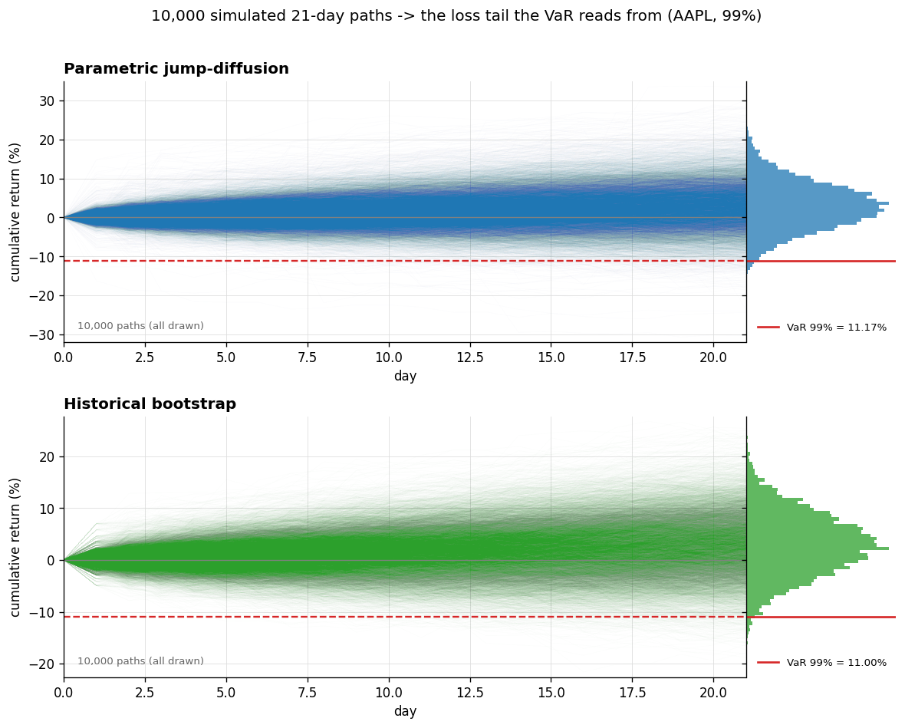

# VaR-Lib - Value-at-risk focused lightweight library

*Six VaR models · ES on every one · three backtests ·
one-call reports.*

A small Value at Risk library built on three ideas:

1. **Readable.** One VaR method per file, each formula written out step by step,
   no black boxes.
2. **Traceable.** Every calculation records each intermediate it produces, so you
   can audit a number line by line (`result.steps` / `result.explain()`).
3. **Validated.** A VaR number is only trustworthy once it's backtested. Industry-standard checks are built in.

---

## In one picture

One call rolls a 99% VaR model through five years of real AAPL prices, runs every
test, and writes this page (`examples/full_backtest.py`):


The same data, every model (`examples/single_instrument.py`):

```
VaR and ES estimated on 2023-01-03 .. 2024-12-31 (502 days):

  Model                          VaR        ES
  Historical                  2.969%    4.048%
  Historical bootstrap        3.227%    3.908%
  Parametric Brownian         3.006%    3.465%
  Parametric OU               3.060%    3.519%
  Parametric jump             2.936%    4.509%
  EWMA / RiskMetrics          2.308%    2.664%

Backtest: rolling Historical VaR, full 2020-2024 history  (confidence = 99%)
  Observations    : 1007
  Breaches        : 11 (rate 1.09%, expected 1.00%)
  Kupiec POF      : p = 0.772 -> OK
  Dynamic Quantile: p = 0.000 -> REJECT
  Basel zone      : GREEN (green<= 15, red>= 24)
```

## Install

```bash
pip install -e .
```

Pulls numpy, pandas, scipy, matplotlib (charts), and pytest (tests). scipy
supplies the standard statistical functions the library relies on: the Normal
pdf/quantile used by the EWMA model, and the binomial and chi-square
distributions behind the Kupiec, Dynamic Quantile, and Basel traffic-light
backtests. It is a relatively heavy dependency (a large, compiled package),
pulled in for convenience and correctness over reimplementing these functions
by hand.

## Quick start

```python
import numpy as np
from varlib import HistoricalVar

prices = np.array([100, 101, 99, 102, 98, 100, 103, 97])
result = HistoricalVar(confidence=0.99).run(prices=prices)   # or run(returns=...)

result.value                 # the VaR, a positive loss fraction (×position = money)
result.expected_shortfall    # the ES (a.k.a. CVaR), always >= VaR
result.explain()             # full step-by-step trace of both
```

Every model returns the same `VarResult`, with `value`, `expected_shortfall`,
`confidence`, `horizon`, `method`, and `steps` (every intermediate, keyed by
name).

## The whole backtest in one call

`run_backtest` rolls a model through history, runs every test, and returns a
`BacktestReport` that prints, plots, or saves itself:

```python
from varlib import HistoricalVar, run_backtest

report = run_backtest(HistoricalVar(0.99), prices=prices, window=250)

report.print()                 # the console summary (breaches + every test)
report.save("backtest.pdf")    # a single print-ready dashboard page

report.kupiec.p_value          # every result is a plain field, nothing hidden
report.traffic_light.zone
```

The saved page is **print-ready** - the title and a self-describing
metrics footer (inputs · result · test verdicts) are generated from the run, so
you pass data, not styling. That is all the examples do: load data, call
`run_backtest`, print/save.

## The models

Each lives in its own file under `varlib/models/`:

| Model                    | Assumes                                              |
|--------------------------|------------------------------------------------------|
| `HistoricalVar`          | Nothing — empirical quantile of past losses.         |
| `HistoricalBootstrapVar` | Future = a reshuffle of the past; gives a std error. |
| `ParametricBrownianVar`  | Returns are Normal (variance-covariance / Gaussian). |
| `ParametricOuVar`        | Returns mean-revert (Ornstein–Uhlenbeck / AR(1)).    |
| `ParametricJumpVar`      | Normal diffusion **plus** rare Merton jumps (fat tails). |
| `EwmaVar`                | EWMA volatility (RiskMetrics λ=0.94); reacts to clustering. |

### Inspecting the internals

The simulation models build the h-day loss distribution by generating thousands of
price paths. Because every intermediate is traced, you can pull those paths out
and inspect. Here are 10,000 21-day paths per model, with the distribution
of where they end up attached on the right
(`examples/charts/paths.py`):



## The backtests

Under `varlib/backtest/`. `run_backtest` runs all three; you can also call them
directly on any `(losses, forecasts)` pair:

| Test                | Function                | Question                                |
|---------------------|-------------------------|-----------------------------------------|
| Kupiec POF          | `kupiec_pof_test`       | The right **number** of breaches?       |
| Dynamic Quantile    | `dynamic_quantile_test` | Breaches **predictable** — clustered or VaR-correlated (Engle-Manganelli)? |
| Basel traffic light | `basel_traffic_light`   | Which supervisory zone (green/yellow/red)? |

## Examples

Self-contained, no arguments - each loads the data and calls the library
directly, so you can read any one top to bottom. To try another model, change the
one line that builds it.

```bash
python examples/single_instrument.py        # every model + a backtest, console
python examples/full_backtest.py            # the dashboard page above (PNG + PDF)
python examples/charts/breaches.py          # each chart on its own
python examples/charts/paths.py             # the simulated-paths picture above
```

## Design notes

- **Log returns** throughout
- **Reproducible.** Every model that simulates takes a seed

## Testing

```bash
pytest -q
```

## License

MIT.
