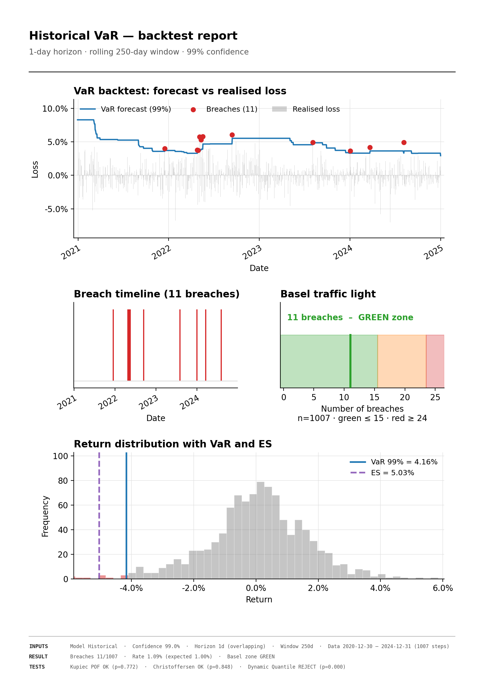

# varlib — readable, validated Value at Risk

*Six VaR models · Expected Shortfall on every one · four regulatory backtests ·
selective multi-page reports · numpy + pandas only.*

A small Value at Risk (VaR) library built around three ideas:

1. **Readability first.** One VaR method per file, each formula written out step
   by step. Two clear lines beat one clever line.
2. **Every intermediate is traced.** Each calculation records every number it
   produces, so you can audit it line by line — no black boxes.
3. **Validation is built in.** A VaR number is only trustworthy once it has been
   backtested. The `backtest` package provides the industry-standard checks.

The whole library depends on nothing but **numpy** and **pandas**. A junior
analyst can read any single file end to end and understand exactly what it does.

> The premise: in a bank, a *documented and validated* Historical VaR beats a
> fancy model nobody can inspect. This library is built for that reality.

---

## In one picture

`examples/full_backtest.py` rolls a 99% VaR model through five years of real
AAPL prices and validates it. The dashboard (`--model historical` by default):



The same run, on the console (`examples/single_instrument.py`):

```
VaR and ES estimated on 2023-01-03 .. 2024-12-31 (502 days):

  Model                          VaR        ES
  Historical                  2.969%    4.048%
  Historical bootstrap        3.227%    3.908%
  Parametric Brownian         2.980%    3.435%
  Parametric OU               3.034%    3.489%
  Parametric jump             2.936%    4.509%
  EWMA / RiskMetrics          2.308%    2.664%

Backtest (rolling Historical VaR, full 2020-2024 history):
  Observations    : 1007
  Breaches        : 11  (rate 1.09%, expected 1.00%)
  Kupiec POF      : p = 0.772  -> OK
  Christoffersen  : p = 0.848  -> OK
  Dynamic Quantile: p = 0.000  -> REJECT
  Basel zone      : GREEN
```

Two things to notice. The **fat-tail jump model** sits well above the Gaussian
VaR and carries the biggest ES — the fat tail piles up *beyond* the VaR point,
where ES sees it and VaR cannot. And the **Dynamic Quantile** test rejects the Historical model
(p ≈ 0) where Kupiec and Christoffersen both pass: the breach *count* is fine and
they are not Markov-clustered, but they are still predictable from the VaR
level — exactly the dependence the modern regression-based test is built to
catch. That is the case for carrying several models and several tests.

---

## Install

```bash
pip install -e .
```

One install gives you everything: the VaR engine (numpy + pandas), the charts
(matplotlib), and the test suite (pytest).

## Quick start

```python
import numpy as np
from varlib import HistoricalVar

prices = np.array([100, 101, 99, 102, 98, 100, 103, 97])
model = HistoricalVar(confidence=0.99)
result = model.run(prices=prices)        # or run(returns=...)

print(result.value)                      # the VaR, as a positive loss fraction
print(result.expected_shortfall)         # the ES, always >= VaR
print(result.explain())                  # full step-by-step trace (VaR and ES)
```

Every model returns the same `VarResult` object — and every model gives **both
VaR and Expected Shortfall (ES)**:

| field                | meaning                                              |
|----------------------|------------------------------------------------------|
| `value`              | VaR as a positive loss fraction (×position = money)  |
| `expected_shortfall` | ES (a.k.a. CVaR): the average loss *given* a breach  |
| `confidence`         | confidence level used                                |
| `horizon`            | holding period; VaR computed directly at this horizon |
| `method`             | which model produced it                              |
| `steps`              | **every intermediate value**, keyed by name          |

VaR answers "how bad is a bad day?"; ES answers "when it goes wrong, how bad is
it on average?". ES is always at least as large as VaR, and it is the number
FRTB moved the industry toward because it sees the whole tail, not just one
point on it. Each model computes ES the way that fits its assumptions:

| Model               | How ES is computed                                       |
|---------------------|----------------------------------------------------------|
| Historical          | Mean of the historical losses beyond the VaR quantile.   |
| Historical bootstrap| Mean ES across resamples (with a standard error).        |
| Parametric Brownian | Gaussian closed form: `-mu + sigma * pdf(z) / (1 - c)`.  |
| Parametric OU       | Same closed form on the *h-step conditional* normal.     |
| Parametric jump     | Mean of the simulated losses beyond the VaR.             |
| EWMA / RiskMetrics  | Gaussian closed form at the EWMA conditional volatility. |

## The models

Each lives in its own file under `varlib/models/`:

| Model                       | File                       | What it assumes                                  |
|-----------------------------|----------------------------|--------------------------------------------------|
| `HistoricalVar`             | `historical.py`            | Nothing — empirical quantile of past losses.     |
| `HistoricalBootstrapVar`    | `historical_bootstrap.py`  | Future = a reshuffling of the past; gives a std error. |
| `ParametricBrownianVar`     | `parametric_brownian.py`   | Returns are Normal (variance-covariance / Gaussian VaR). |
| `ParametricOuVar`           | `parametric_ou.py`         | Returns mean-revert (Ornstein–Uhlenbeck / AR(1)).|
| `ParametricJumpVar`         | `parametric_jump.py`       | Normal diffusion **plus** rare Merton jumps (fat tails). |
| `EwmaVar`                   | `ewma.py`                  | Volatility is an EWMA (RiskMetrics λ=0.94); reacts to clustering. |

All take `confidence` and `horizon`, accept either `prices=` or `returns=`, and
auto-calibrate their parameters from the data (with optional overrides). The
`horizon` is computed **directly** at the holding period — the h-day VaR is the
quantile of the h-day loss distribution (overlapping h-day historical returns, a
Normal with h-day mean and variance, the OU h-step-ahead law, or a simulated
h-day path), not a one-day number scaled by √h. For mean-reverting (OU) series
√t scaling is plainly wrong; here the variance correctly saturates instead.

## Rolling a model through history

Backtesting starts by turning one series into a *series of VaR forecasts*. That
is the library's headline workflow, and it lives in `varlib.backtest`:

```python
from varlib import HistoricalVar, rolling_var, rolling_backtest

model = HistoricalVar(confidence=0.99, horizon=10)

# series in, series of VaR out — one forecast per step
var_series = rolling_var(model, prices=prices, window=250)

# or get the aligned (losses, forecasts, dates) a backtest needs in one call
realised_losses, var_forecasts, dates = rolling_backtest(model, prices=prices, window=250)
```

`rolling_backtest` lines up each forecast with the loss **actually realised over
the matching holding period** (the next *h* days for an h-day VaR), so forecast
and outcome are always on the same footing. Pass a pandas Series and the
end-of-period dates come from its index; pass a plain array and you get an integer
axis. `overlap=False` switches to non-overlapping (independent) windows.

## The backtests

Under `varlib/backtest/`. Given the rolled forecasts above, compare each to the
realised loss over the **same holding period** and validate the breach sequence:

| Test                  | Function                 | Question it answers                          |
|-----------------------|--------------------------|----------------------------------------------|
| Kupiec POF            | `kupiec_pof_test`        | Are there the right **number** of breaches?  |
| Christoffersen        | `christoffersen_test`    | Are breaches **independent**, or clustered?  |
| Dynamic Quantile      | `dynamic_quantile_test`  | Can breaches be **predicted** (from their own past or the VaR level)? |
| Basel traffic light   | `basel_traffic_light`    | Which supervisory zone (green/yellow/red)?   |

The Christoffersen test also exposes the **joint conditional-coverage** statistic
(`lr_conditional` / `p_value_conditional` — the right *number* and *independent*
together). The Dynamic Quantile test (Engle-Manganelli) is the modern
regression-based generalisation: it regresses the breach indicator on its own
lags and the contemporaneous VaR, catching dependence the Markov-chain
Christoffersen misses. Both operate purely on the breach sequence /
`(losses, forecasts)`, so every model gets them with no per-model code.

```python
from varlib.backtest import count_breaches, kupiec_pof_test, basel_traffic_light

summary = count_breaches(realised_losses, var_forecasts)
kupiec  = kupiec_pof_test(summary.steps["is_breach"], confidence=0.99)
zone    = basel_traffic_light(summary.n_breaches, summary.n_observations)
```

## Charts

The `varlib.plotting` package turns a backtest into report-ready charts.
One chart per file, each returning a matplotlib Axes:

| Function              | Chart                                                  |
|-----------------------|--------------------------------------------------------|
| `breaches_chart`      | VaR forecast vs realised loss, breaches marked in red. |
| `breach_timeline`     | A timeline of breach days, to reveal clustering.       |
| `traffic_light_chart` | Basel green/yellow/red zones with the breach count.    |
| `distribution_chart`  | Return histogram with VaR and ES lines on the tail.    |
| `dq_chart`            | Dynamic Quantile broken down by regressor: which term (a lagged breach, or the VaR level) makes breaches predictable. |
| `backtest_panel`      | Every backtest verdict (Kupiec/Christoffersen/DQ/Basel) as one compact table. |
| `backtest_dashboard`  | The four core charts on a single figure.               |

```python
from varlib.plotting import backtest_dashboard
fig = backtest_dashboard(realised_losses, var_forecasts, dates=dates, confidence=0.99)
fig.savefig("backtest.png", dpi=120, bbox_inches="tight")
```

### Selective, multi-page reports

`backtest_dashboard` is a fixed one-page layout. For a print-ready report you can
**choose** which blocks to show and let it spill across pages — `build_report`
composes the same chart primitives, and `save_report` writes a single figure or a
multi-page PDF (PNG export writes one file per page):

```python
from varlib.plotting import build_report, save_report

report = build_report(
    realised_losses, var_forecasts, dates=dates, confidence=0.99,
    sections="all",                 # or e.g. ["breaches", "tests"]
    backtests={"kupiec": kupiec, "christoffersen": chris,
               "dynamic_quantile": dq, "traffic_light": zone},
)
save_report(report, "report.pdf")   # one or two A4 pages, as needed
```

Sections: `breaches`, `timeline`, `traffic_light`, `distribution`, `dq`, `tests`.
The default (no `sections`) reproduces the dashboard's one-page set, so nothing
regresses.

The `examples/` folder shows each of these in action. Every example takes
`--model historical|bootstrap|brownian|ou|jump|ewma`
(default `historical`) and `--confidence`, and writes to `examples/output/`:

```bash
# the full dashboard + printed backtest stats
python examples/full_backtest.py --model ewma

# a selective, multi-page report (two A4 pages)
python examples/full_backtest.py --model jump --sections all
python examples/full_backtest.py --model ewma --sections breaches,tests

# or each chart on its own
python examples/charts/breaches.py       --model brownian
python examples/charts/timeline.py       --model ou
python examples/charts/traffic_light.py  --model jump
python examples/charts/distribution.py   --model historical
```

See **`examples/README.md`** for the full list.

---

See **`examples/single_instrument.py`** for the full workflow on real data
(daily AAPL prices, 2020–2024, in `examples/data/AAPL.csv`):
VaR on the last two years → roll the model through the full five years →
backtest. The committed CSV means the example runs offline with no extra
dependency beyond pandas.

## Inspecting a calculation

```python
result = HistoricalVar(0.99).run(returns=returns)
print(result.explain())
# Method     : historical
# Confidence : 0.99
# VaR        : 2.3412% loss
# ES         : 2.6889% loss
# Steps:
#   - returns: array(...)
#   - losses: array(...)
#   - sorted_losses: array(...)
#   - var: 0.023412
#   - es: 0.026889
#   ...
```

Nothing is hidden. If a regulator or a colleague asks "where does this number
come from?", the answer is in `result.steps`.

## Project layout

```
varlib/
  base.py                  VarModel abstract class + VarResult contract
  _returns.py              price -> log return conversion (traced)
  models/                  one VaR method per file (six of them)
  backtest/                rolling VaR + kupiec / christoffersen / dynamic quantile / traffic light
  plotting/                one chart per file + report composer (matplotlib)
examples/
  single_instrument.py     end-to-end: price -> VaR -> backtest (console)
  full_backtest.py         roll a model, print stats, render the dashboard
  charts/                  one script per chart (--model selectable)
  _common.py               shared loader + rolling backtest + --model CLI
  data/AAPL.csv            real AAPL prices, 2020-2024 (committed)
  output/                  generated PNGs (created on first run)
tests/
  test_historical.py       ... one file per model
  test_parametric_ou/      sub-folder: calibration tested apart from the VaR
  test_parametric_jump/    sub-folder: jump separation tested apart from the VaR
  backtest/                kupiec / christoffersen / traffic light
  plotting/                one file per chart
```

## Design notes

- **Log returns** are used throughout, because they are additive over time —
  so the h-day return is just the **sum** of the daily returns, which is how both
  the h-day forecast and the h-day realised loss are built.
- **No scipy.** The normal quantile (Acklam) and the chi-square tail (incomplete
  gamma) are both implemented from standard, well-conditioned numerical routines
  so the dependency footprint stays at numpy + pandas.
- **Reproducible.** Every model that simulates takes a `seed`; same seed → same
  number, every time.

## Testing

```bash
pytest -q
```

Each VaR method has its own test file. Methods with internal helpers (OU
calibration, jump separation) get a sub-folder so the helper is tested in
isolation from the VaR that uses it. Backtests and charts have their own test
folders.

Coverage includes the things that matter for a risk library: ES ≥ VaR for every
model, the Gaussian VaR/ES closed forms checked against textbook values, the
chi-square and normal routines checked against known quantiles, OU parameter
recovery on simulated data, and the Basel zones matching the published 250-day
table (green 0–4, yellow 5–9, red 10+).

## License

MIT.
